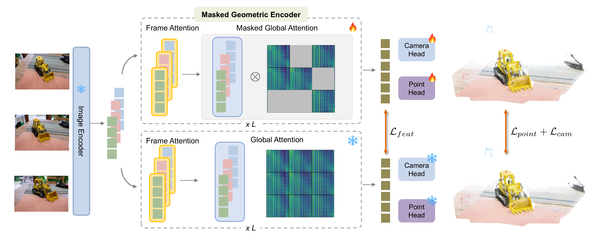
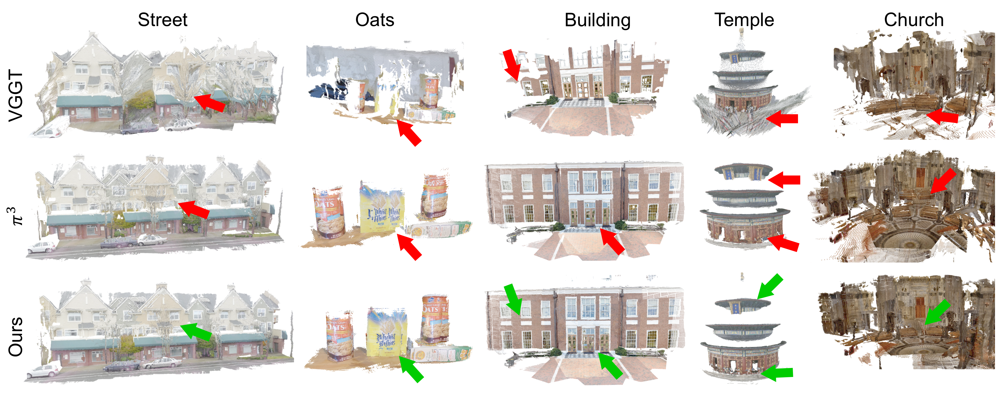

<div align="center">
<h1>Less Context, Better Geometry: Masked Geometric Encoder for Robust 3D Foundation Models</h1>
</div>


### [Paper](https://arxiv.org/abs/2610.06813)


>Zhimin Shao, Xijun Liu, Zhaoliang Zhang, Yutao Tang, Abhay Yadav, Rama Chellappa, Cheng Peng


## News
- **[2026/10/6]** Paper released on [arXiv](https://arxiv.org/abs/2610.06813).
- **[2026/10/2]** Training/evaluation code release.


## Overview

Given a sequence of images, during training, MGE masks the global attention randomly to limit the all-to-all cross-view information flow. To promote richer intermediate feature representation, we further introduce constrain MGE to produce similar 3D features compared to the full-attention teacher encoder output.



### Reconstruction Visualizations




### Installation

1. Clone MGE
```bash
git clone https://github.com/Zhimin00/MGE.git
cd MGE
```
2. Create conda environment
```bash
conda env create -f mge.yaml
```
### Download Checkpoints
Please download pretrained teacher model from [here](https://huggingface.co/yyfz233/Pi3/resolve/main/model.safetensors) and save at `ckpt/`.

The checkpoint of MGE is available at [Hugging Face](https://huggingface.co/shaozhimin/MGE). Download it and save at `checkpoints/`.

## Data Preparation
### Training Datasets
Our training data includes 14 datasets. Please download the datasets from their official sources and refer to [CUT3R](https://github.com/CUT3R/CUT3R/blob/main/docs/preprocess.md) for processing these datasets.

  - [ARKitScenes](https://github.com/apple/ARKitScenes) 
  - [BlendedMVS](https://github.com/YoYo000/BlendedMVS)
  - [CO3Dv2](https://github.com/facebookresearch/co3d)
  - [MegaDepth](https://www.cs.cornell.edu/projects/megadepth/)
  - [MVS-Synth](https://phuang17.github.io/DeepMVS/mvs-synth.html)
  - [ScanNet++](https://kaldir.vc.in.tum.de/scannetpp/) 
  - [ScanNet](http://www.scan-net.org/ScanNet/)
  - [Spring](https://spring-benchmark.org/)
  - [Hypersim](https://github.com/apple/ml-hypersim)
  - [WildRGB-D](https://github.com/wildrgbd/wildrgbd/)
  - [WayMo Open dataset](https://github.com/waymo-research/waymo-open-dataset)
  - [Virtual KITTI 2](https://europe.naverlabs.com/research/computer-vision/proxy-virtual-worlds-vkitti-2/)
  - [OmniObject3D](https://omniobject3d.github.io/)
  - [PointOdyssey](https://pointodyssey.com/)


## Training

```bash
cd src/
NCCL_DEBUG=TRACE TORCH_DISTRIBUTED_DEBUG=DETAIL HYDRA_FULL_ERROR=1 accelerate launch --multi_gpu --num_processes 2 --main_process_port 26902 ./mgepi3train.py --config-name mgepi3train_stage1
```

## Evaluation

Please refer to the [evaluation README](https://github.com/Zhimin00/MGE/blob/evaluation/README.md) for evaluation setup, datasets, and instructions.

## Citation

If you find our work useful, please consider citing:

<!-- ```bibtex
@misc{wang2025pi3,
      title={$\pi^3$: Scalable Permutation-Equivariant Visual Geometry Learning}, 
      author={Yifan Wang and Jianjun Zhou and Haoyi Zhu and Wenzheng Chang and Yang Zhou and Zizun Li and Junyi Chen and Jiangmiao Pang and Chunhua Shen and Tong He},
      year={2025},
      eprint={2507.13347},
      archivePrefix={arXiv},
      primaryClass={cs.CV},
      url={https://arxiv.org/abs/2507.13347}, 
}
``` -->


<!-- ## Evaluation

### Evaluation Datasets
Please refer to [MonST3R](https://github.com/Junyi42/monst3r/blob/main/data/evaluation_script.md), [Spann3R](https://github.com/HengyiWang/spann3r/blob/main/docs/data_preprocess.md) and [Pi3](https://github.com/yyfz/Pi3/blob/evaluation/datasets/preprocess/prepare_eth3d.sh) to prepare Sintel, Bonn, KITTI, NYU-v2, ScanNet, 7scenes, Neural-RGBD and ETH3D datasets.

The evaluation code follows [MonST3R](https://github.com/Junyi42/monst3r/blob/main/data/evaluation_script.md), [CUT3R](https://github.com/CUT3R/CUT3R/blob/main/docs/eval.md), [VGGT](https://github.com/facebookresearch/vggt), [Pi3](https://github.com/yyfz/Pi3/tree/evaluation) and [FastVGGT](https://github.com/mystorm16/FastVGGT).

```bash
### Pointmap
python mv_recon/eval.py
python mv_recon/eval_fast.py

### Camera Pose
python relpose/eval_dist.py

### Multi-view Depth
python video_depth/infer.py
python video_depth/eval.py
``` -->
